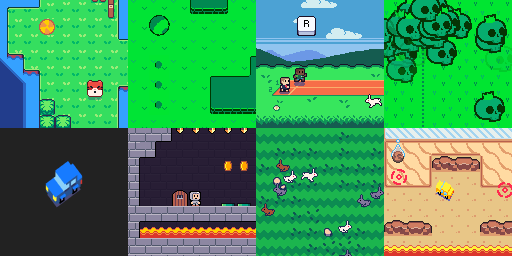

Diorama.js is a small Html5 2D game engine, based on canvas with no dependency.

[Demos and examples on codepen](https://codepen.io/collection/AevkWM/#)

## installation

[Download this repository](https://github.com/gtibo/diorama/archive/master.zip), and de-zip it. It contain an **Empty project folder** with a single scene and basic assets.
Launch the project by opening the index.html file in a web browser. Then you will only need to refresh your page after any change in the code to see them applied in your game.

## usage
You can use any code editor you want to edit a project.
To display something on the screen diorama require at least one scene.
```javascript
let demo = new Scene("demo");
demo.init = function() {
	// this function is called by default every time a scene is started
	// all the variables written here will be reserved to this scene only
	// to access methods or variables from the parent element (diorama) use "this.world"
	// example > this.world.W to get the width of the canvas
};
demo.render = function() {
	// this function is executed 60 times per secondes by default
};
```
don't forget to add your scenes to your game object
the addScene function links the **scene** with the world
```javascript
let game = new Diorama(manifest);
    game.addScene(demo);
```
By default diorama starts with the first added scene, but you can specify in the manifest by which scene you want your project to start
```javascript
let manifest = createManifest();
    manifest.set.start_screen("menu");
```
Diorama is under the [MIT license](https://opensource.org/licenses/MIT)